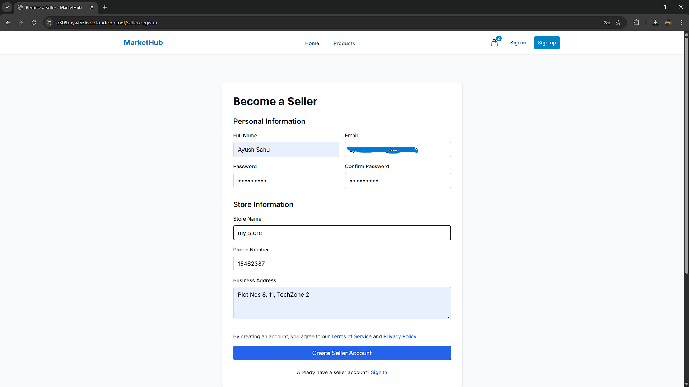
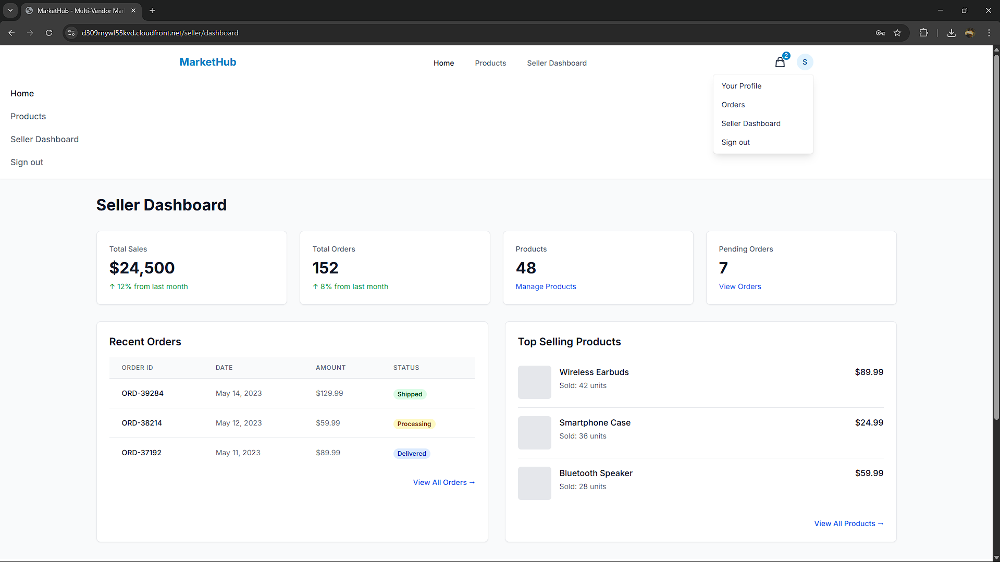
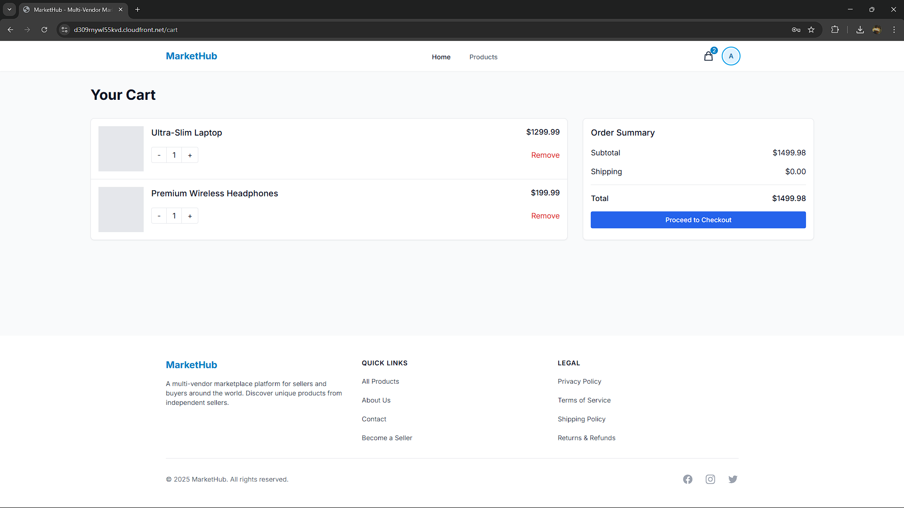
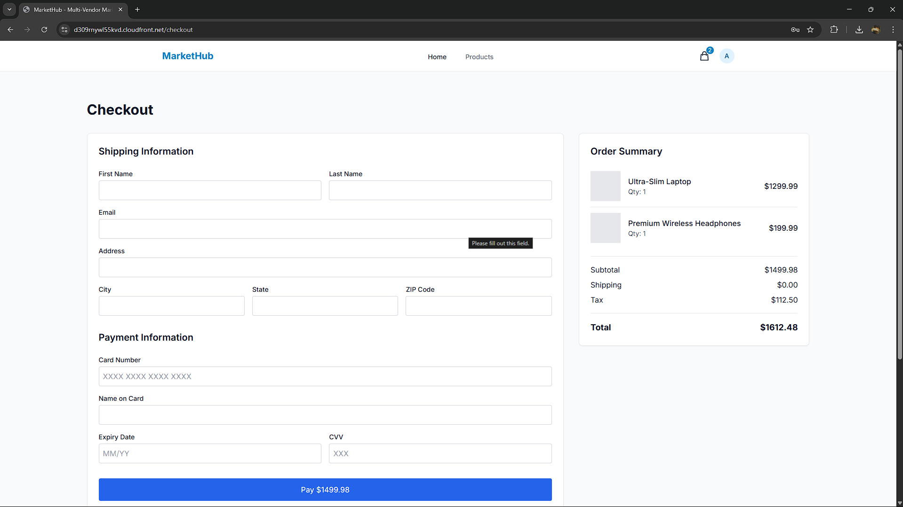

# My Project

#MY WEBSITE








# Multi-Vendor E-Commerce Platform

A production-ready e-commerce platform built with React, TypeScript, Node.js, and AWS services.

## Tech Stack

### Frontend
- React with TypeScript
- Framer Motion for animations
- Tailwind CSS for styling
- Mobile-first responsive design

### Backend
- Node.js/Express with TypeScript
- PostgreSQL database
- Prisma ORM

### Authentication & Storage
- AWS Cognito for user authentication
- AWS S3 for product image storage

### Payments
- Stripe for payment processing

### Deployment
- AWS Elastic Beanstalk (Backend)
- AWS S3/CloudFront (Frontend)
- AWS ECR for container registry
- GitHub Actions for CI/CD

## Features
- Multi-vendor marketplace
- Seller dashboard for product management
- Animated product gallery with zoom functionality
- Role-based access control (buyer/seller)
- Responsive design for all devices
- SEO optimized

## Local Development Setup

### Prerequisites
- Node.js (v16+)
- Docker and Docker Compose
- AWS CLI configured with appropriate permissions

### Getting Started
1. Clone the repository
   ```
   git clone <repository-url>
   cd multi-vendor-ecommerce
   ```

2. Install dependencies
   ```
   # Install frontend dependencies
   cd frontend
   npm install

   # Install backend dependencies
   cd ../backend
   npm install
   ```

3. Set up environment variables
   ```
   # In frontend directory
   cp .env.example .env.local

   # In backend directory
   cp .env.example .env
   ```

4. Start local development environment
   ```
   # Start Docker containers (PostgreSQL)
   docker-compose up -d

   # Start backend server
   cd backend
   npm run dev

   # Start frontend server
   cd frontend
   npm run dev
   ```

5. Access the application
   - Frontend: http://localhost:3000
   - Backend API: http://localhost:4000

## AWS Deployment Guide

### Required AWS Services
- AWS Cognito: User authentication
- AWS RDS: PostgreSQL database
- AWS S3: Frontend hosting and product images
- AWS CloudFront: Content distribution
- AWS Elastic Beanstalk or ECS: Backend hosting
- AWS ECR: Docker image repository

### AWS Setup Prerequisites
1. AWS Account with Admin access
2. AWS CLI installed and configured
3. GitHub repository with your codebase

### Step 1: Set Up AWS Infrastructure
```bash
# Deploy CloudFormation stack for infrastructure
aws cloudformation create-stack \
  --stack-name ecommerce-infrastructure \
  --template-body file://deployment/cloudformation/main.yml \
  --parameters ParameterKey=DatabaseUsername,ParameterValue=postgres \
               ParameterKey=DatabasePassword,ParameterValue=YourSecurePassword \
               ParameterKey=DatabaseName,ParameterValue=ecommerce \
               ParameterKey=Environment,ParameterValue=production \
  --capabilities CAPABILITY_IAM
```

### Step 2: Create ECR Repositories
```bash
# Create ECR repositories for backend and frontend
aws ecr create-repository --repository-name ecommerce/backend
aws ecr create-repository --repository-name ecommerce/frontend
```

### Step 3: Set Up GitHub Secrets

You need to add the following secrets to your GitHub repository:

| Secret Name | Description |
|-------------|-------------|
| AWS_ACCESS_KEY_ID | IAM user access key |
| AWS_SECRET_ACCESS_KEY | IAM user secret key |
| AWS_REGION | Region (e.g., us-east-1) |
| DATABASE_URL | PostgreSQL connection string |
| AWS_COGNITO_USER_POOL_ID | Cognito user pool ID |
| AWS_COGNITO_CLIENT_ID | Cognito app client ID |
| AWS_COGNITO_IDENTITY_POOL_ID | Cognito identity pool ID |
| AWS_S3_BUCKET | S3 bucket for frontend |
| AWS_CLOUDFRONT_DISTRIBUTION_ID | CloudFront distribution ID |
| BACKEND_URL | URL of the backend API |
| AWS_EB_APP_NAME | Elastic Beanstalk app name |
| AWS_EB_ENVIRONMENT | Elastic Beanstalk environment |
| AWS_EB_BUCKET | S3 bucket for EB deployments |

### Step 4: Push Code to Trigger Deployment
```bash
git push origin main
```

After pushing, GitHub Actions will:
1. Build the frontend and backend
2. Run tests
3. Build Docker images
4. Push images to ECR
5. Deploy the backend to Elastic Beanstalk
6. Deploy the frontend to S3/CloudFront

## Maintenance

### Database Migrations
```bash
cd backend
npx prisma migrate deploy
```

### Manual Deployment
```bash
# Backend
cd backend
npm run build
npm run deploy:prod

# Frontend
cd frontend
npm run build
npm run deploy:prod
```

## License
MIT 
